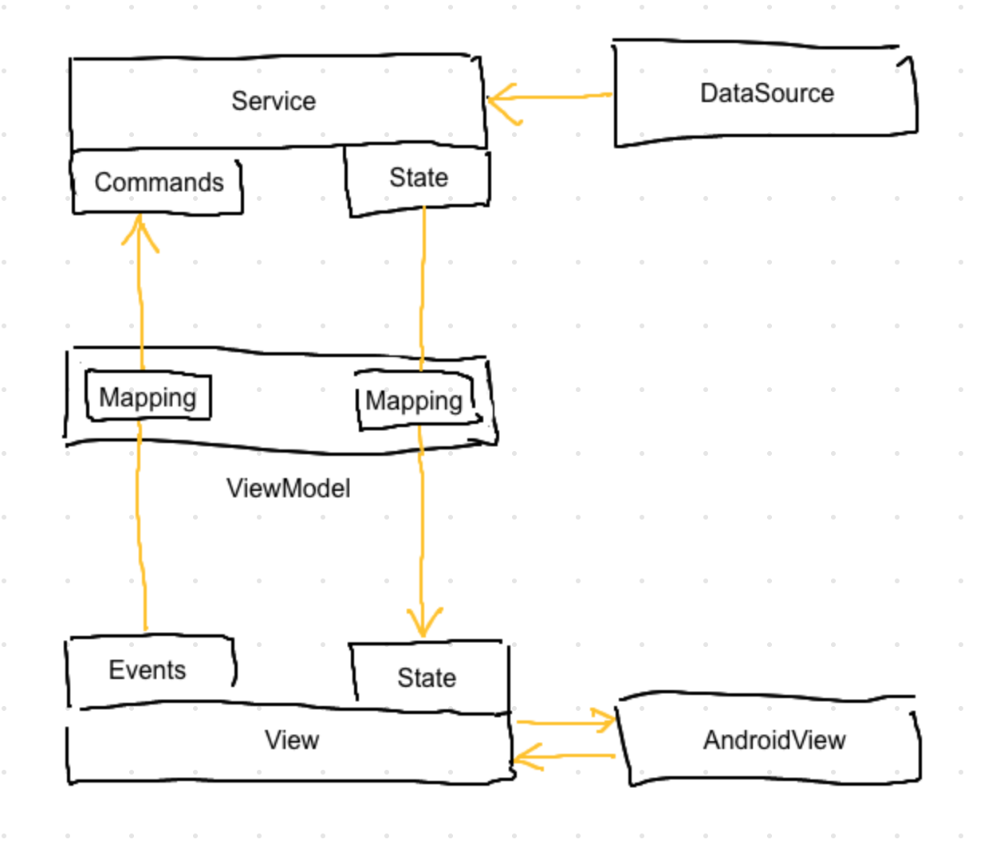
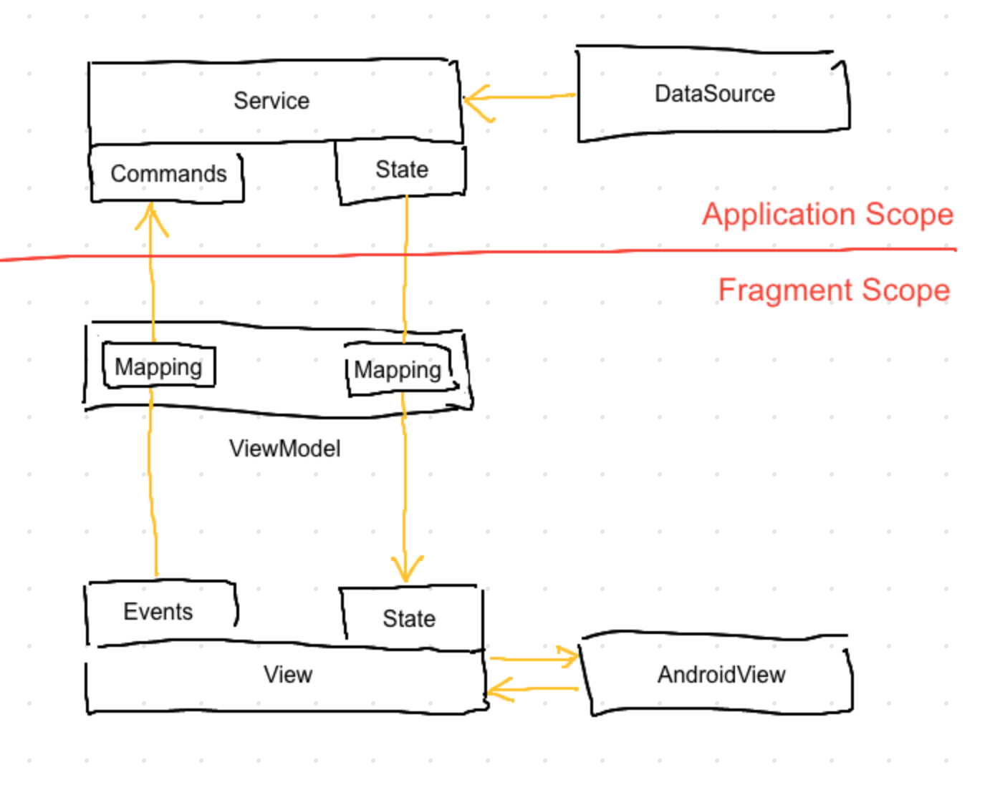
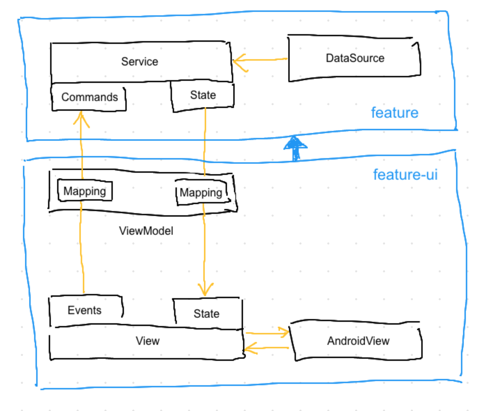

This repository contains a demo project, which
* lists top Android Github repositories
* shows a simple detail view for a repository selected from the list

# Features
* Architecture: [Model-View-Intent][1] + reactive data binding (using RxJava2).
* RecyclerView loads data gradually, page by page.
* Loaded data gets cached in memory and survives configuration changes (no Jetpack's ViewModel is used).
* Code is written in accordance to [SOLID principles][2].
* Modularisation is done with [dependency inversion principle][3] in mind.

# Architecture

Each application screen is built around the architecture shown in the diagram below and follows the same [Model-View-Intent][1] pattern.

*Service* is responsible for performing operations and delivering data. It implements Command Query Responsibility Segregation ([CQRS][4]) pattern and is capable of receiving commands and dispatching state. *View* has own interface, which reflects the one of the service. It can send events and accept states, which are specific to each view. *ViewModel* is the layer in between, which binds *Views* and *Services* by mapping their events/commands and states.

As you might notice, the *View* is decoupled from *AndroidView*. It is because they have different responsibilities. *AndroidView* is there to hide complexity of native Android views behind a simpler contract. *View* defines proper events/state contract and adapts it to the simplified contract of *AndroidView*.

# Scoping

While *AndroidView*, *View* and *ViewModel* can be created and destroyed multiple times by following the activity lifecycle, *Service* lives in a broader scope and keeps data cached in memory. In this demo app the services reside in application scope and the views reside in fragment scope. Even better option would be to keep services in a "retained" scope corresponding to the scope of [ViewModel][5] in terms of Android Jetpack.

# Packaging

The code in this app is grouped by features in the first place and then it is devided into modules by scopes. Thus each new implemented application screen will add at least two more modules to the app: `feature` - with UI-agnostic part of the feature implementation and `feature-ui` with UI-specific implementation. Dependency direction is always from the UI-specific module to the one containing services.

# Structure

This application could use any library for dependency injection or even no library at all. I have chosen [Magnet][6] dependency injection library because it has simple configuration (there are almost no DI-related classes) and it supports dependency inversion between modules. The only rule I had to follow was to keep `app` module free of code. The `app` module is mainly used for *assembling* other modules. Dependencies defined in `app` module declare the code to be included in the resulting apk. Correspondingly, the other modules must not depend on the `app` module. They will introduce a circular dependency, if they do.

🔥 Notice the `debugImplementation` dependencies to the `leakcanary` stuff in the `app` modules. By declaring those dependencies, the app will include `leakcanary` library into debug build, but not into release build. No code modifications or no-op stubs are needed for release build. This build flexibility is achieved by using `magnetx` application extension and adapter for `leakcanary` library.

[1]: https://cycle.js.org/model-view-intent.html
[2]: https://en.wikipedia.org/wiki/SOLID
[3]: https://en.wikipedia.org/wiki/Dependency_inversion_principle
[4]: https://martinfowler.com/bliki/CQRS.html
[5]: https://developer.android.com/jetpack/arch/viewmodel#lifecycle
[6]: https://github.com/beworker/magnet
